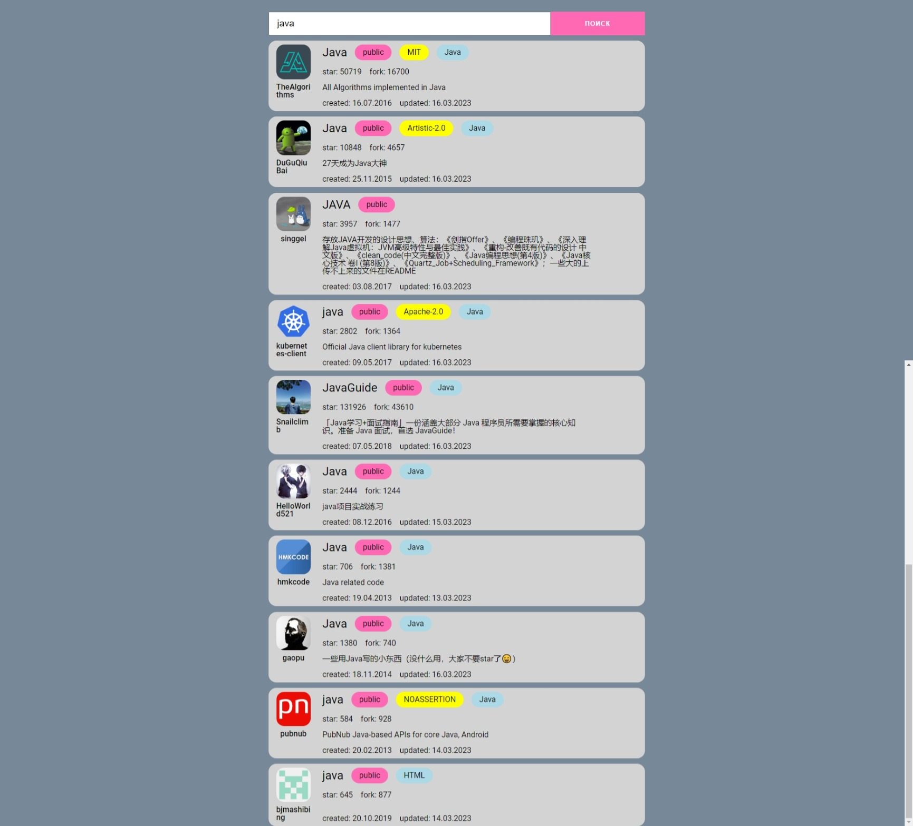
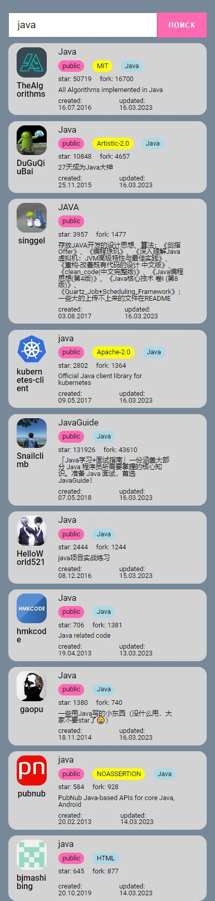

# Поиск репозиториев GitHub по подстроке

В результатах выводятся первые 10 репозиториев. Нажав на название репозитория можно перейти на страницу GitHub этого репозитория. Нажав на имя автора можно перейти на профиль автора на GitHub.
Дополнительно отображается видимость репозитория(public/private), тип лицензии, язык проекта(если указан), количество звезд и форков, когда репозиторий создан и когда обновлен.

## Технологии
- JavaScript
- SCSS
- Webpack

## Preview

- desktop

- mobile

## Разработка

### Требования

Для установки и запуска проекта необходим NodeJS v16+

### Установка зависимостей

Для установки зависимостей, выполните команду:

`npm i`

### Запуск Development server
`npm run dev`

### Создание билда
Чтобы выполнить production сборку, выполните команду:

`npm run build`